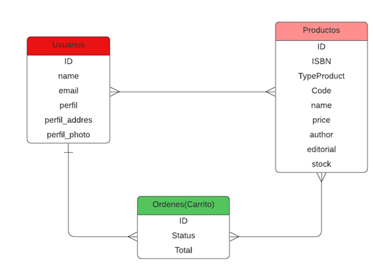

# Backend-challenge

## Inicializacion
- Crear un archivo .env como el archivo .envExample
- Crear una base de datos con el nombre 'eCommerce'
- Dentro de la carpeta API por consola ejecutar `npm install`, para instalar las dependencias
- Ejecutar `npm run dev`, se levanta el servidor y se crea los modelos de la base de datos.

## Documentacion Rutas:

- [DOC Postman](https://documenter.getpostman.com/view/17914746/Uz5CLHmS)

## Tecnologías utilizadas:
- [ ] NodeJs
- [ ] Express
- [ ] Sequelize
- [ ] PostgresSQL

## Diagrama ER

